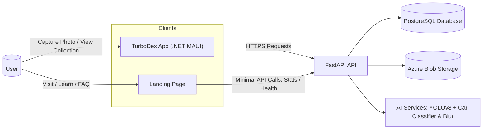
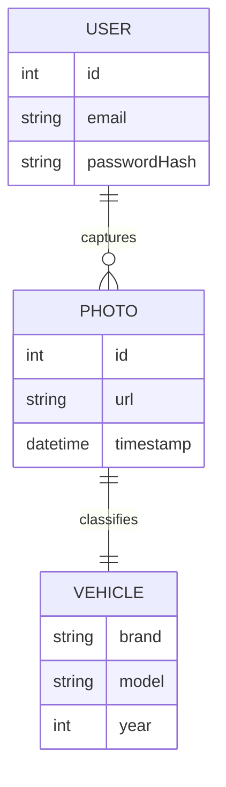
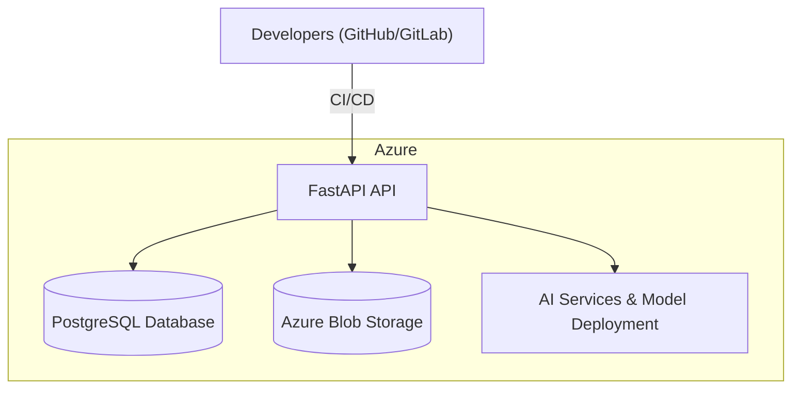
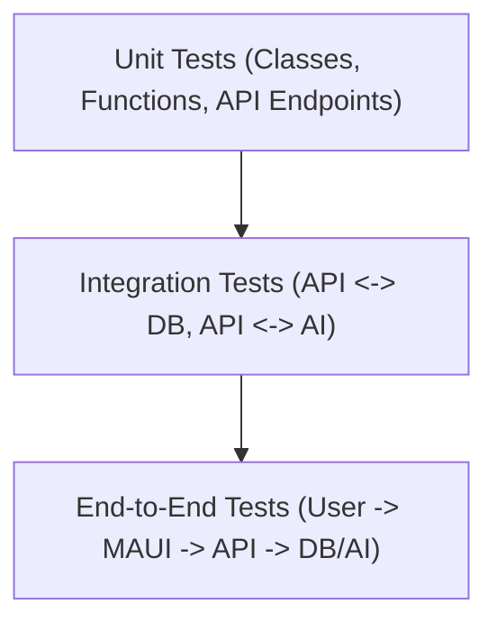
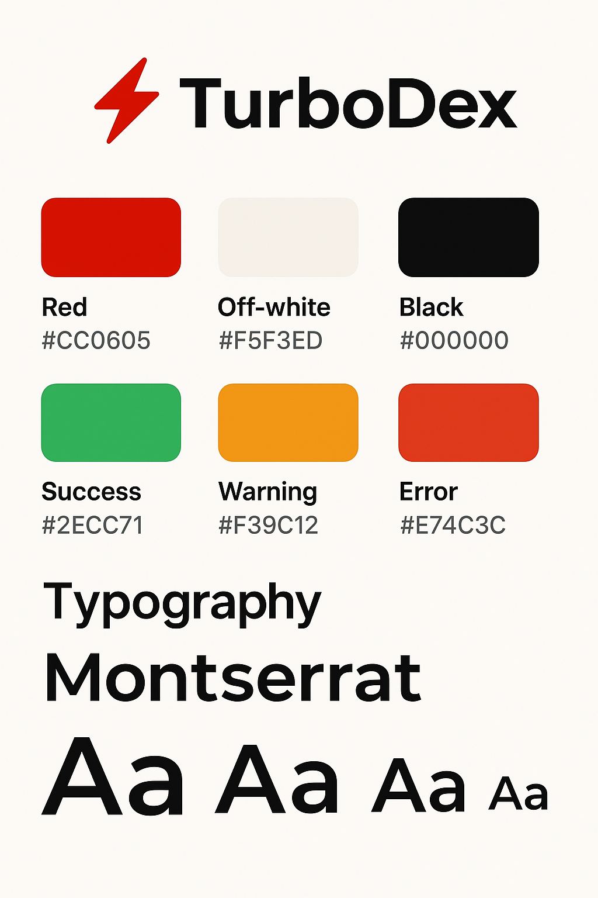
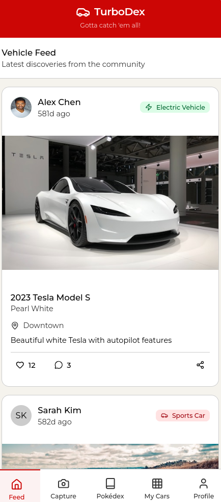
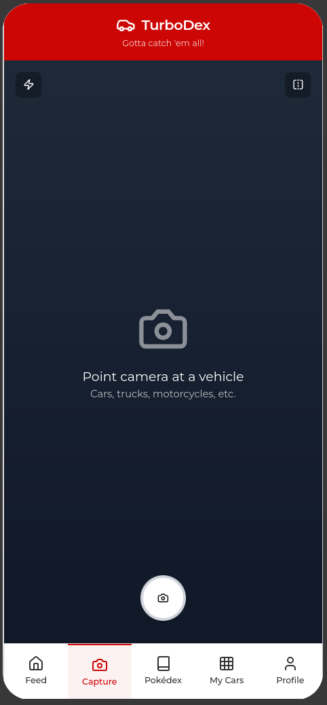
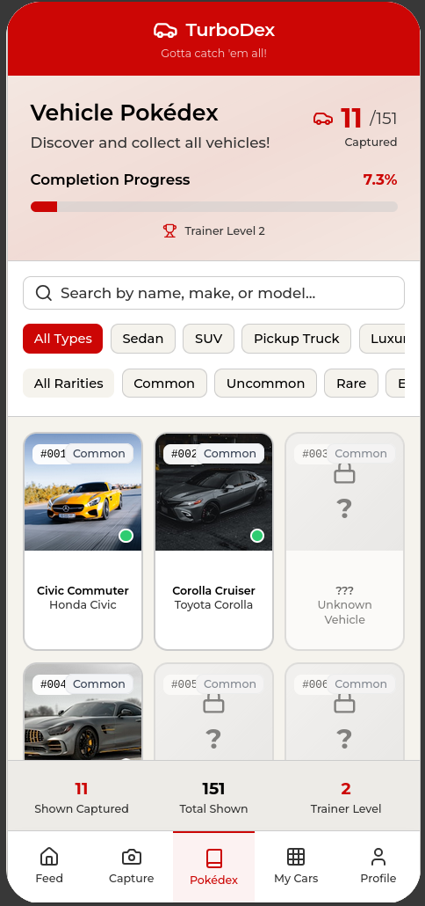
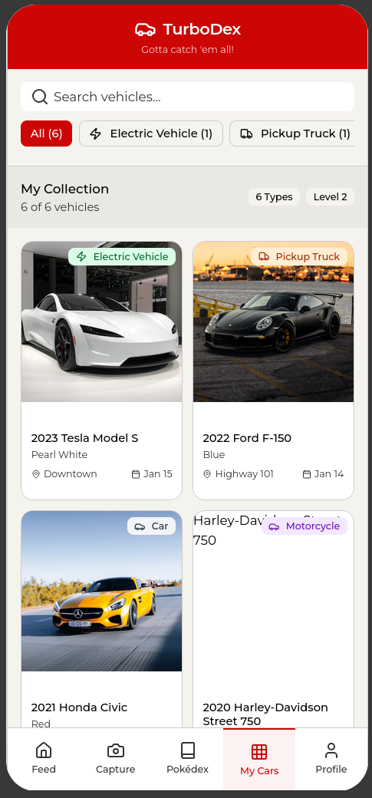
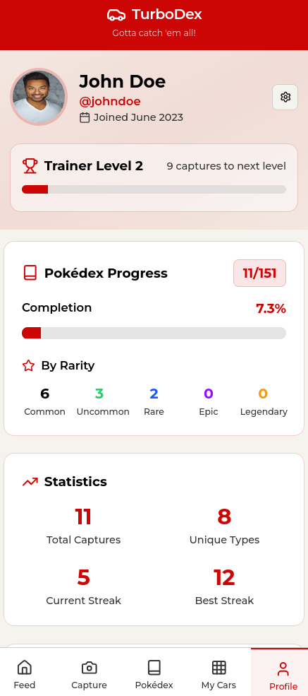

# **TurboDex**

*“Gotta snap ’em all!”*


---
## Table of Contents

1. [Project Description](#step-1-project-description)
2. [Preliminary Architecture](#step-2-preliminary-architecture)
3. [Mockups / Landing Page](#step-3-mockups--landing-page)
4. [Technical Choices](#step-4-technical-choices)
5. [Work Process](#step-5-work-process)
6. [Development Tools](#step-6-development-tools)
7. [Deployment Environment](#step-7-deployment-environment)
8. [CI/CD Pipeline](#step-8-cicd-pipeline)

---

# Week 1


## Step 1: Project Description

### Project Objective
**TurboDex** is a cross-platform mobile and web application that lets users discover, recognize, and collect cars in real-time using AI, while keeping privacy at the forefront.

### Functional Requirements
- Snap cars in the wild with a mobile or web camera
- Instantly recognize **make & model** using **AI fine-tuned on car datasets**
- Automatically **blur faces and license plates** for privacy
- Collect and track sightings in a personal **Pokédex-like collection**
- Share and explore a community-driven **feed of car spots**
- View and manage user profile with stats and collection history

### Non-Functional Requirements
- Cross-platform: mobile (iOS/Android via .NET MAUI) and web
- Privacy-first: all images processed to blur sensitive elements
- Scalable and responsive: handle thousands of users and images
- High performance: real-time AI recognition with minimal latency
- Secure: protect user data with encryption and secure authentication
- Maintainable: clean codebase, modular components, and CI/CD integration

### Features 
 **AI Car Recognition** – Identify car make/model instantly
 **Privacy First** – Automatic blurring of faces & license plates
 **Gamified Collection** – Build your personal Pokédex of cars
 **Social Feed** – Share and discover cars spotted worldwide
 **Cross-Platform App** – Works on iOS, Android, and Web
 **Landing Page** – Clean marketing site with FAQs, About, and download links

## Step 2: Preliminary Architecture

### Architecture



### Data Model



### Deployment



### Testing



* Architecture diagram now explicitly includes **Landing Page**.
* Shows relationships between **clients, API, AI services, database, and storage**.
* Deployment diagram demonstrates CI/CD flow from developers to cloud services.
* Testing strategy covers **unit, integration, and end-to-end tests**.


## Step 3: Mockups / Landing Page


### Mockups

#### Visual identity



#### Home / Feed


#### Camera


#### TurboDex


#### My Cars


#### Profile


### Landing page

Available here : [TurboDex Landing page URL](https://dansnts.github.io/TurboDex/)

Code here : [TurboDex Landing page code](docs/)


## Step 4: Technical Choices

* Frontend: Flutter (cross-platform mobile)
* Backend: .NET Core (Azure-friendly) / Node.js for serverless functions
* AI: PyTorch for training, TensorFlow Lite for mobile inference, OpenCV for blurring faces and plates
* Database: Azure PostgreSQL Flexible Server
* Cloud Storage: Azure Blob Storage (Student Pack \$100 credit)
* CI/CD: GitHub Actions
* Version Control: Git + GitHub

## Step 5: Work Process

* Git Flow: main / develop / feature branches
* Agile/Scrum workflow using MURAL (Available here) : [MURAL URL](https://app.mural.co/t/test01211/m/test01211/1755517756505/208f4728ec714f998d951d524f494f457b5bf128?sender=ua561b35d4a01fabeed351903)

  * 3-week sprints
  * Daily stand-ups via Teams or Discord
  * Sprint review and retrospective at end
  * Sprint planning and backlog grooming

## Step 6: Development Tools

* Issue tracker: GitHub Issues (Kanban board: To Do → In Progress → Review → Done)
* Task assignment: per feature or bug fix
* Code reviews: mandatory pull requests
* IDEs: Visual Studio Code & Android Studio (Flutter & backend), PyCharm (AI) + Jupyter Notebook
* Containerization: Docker for local dev consistency

## Step 7: Deployment Environment

* Backend hosting: Azure App Service (Linux containers)
* Database hosting: Azure Database for PostgreSQL Flexible Server
* Image storage: Azure Blob Storage with public read URLs for app access
* AI hosting: Azure VM with GPU (for training) and model API deployment
* Monitoring: Azure Application Insights

## Step 8: CI/CD Pipeline

* Trigger build on push to develop branch
* Run automated tests:

  * Unit tests for backend
  * Integration tests for API <-> DB <-> AI
  * End-to-end tests for Flutter app
* Build app artifacts for iOS & Android
* Deploy to staging environment automatically
* Run smoke tests on staging
* Merge to main triggers production deployment
* Monitor production logs and AI model performance


``` ASCII
turbodex/
│
├── docs/          # Static site (HTML/CSS/JS)
│   ├── images/
│   ├── index.html
│   ├── package.json
│   ├── script.js
│   └── style.cs

│
├── mobile-app/            # Flutter app
│   ├── lib/
│   ├── .gitignore
│   └── pubspec.yaml
│
├── backend/               # FastAPI / Node backend
│   ├── app/
│   ├── Dockerfile
│   ├── .gitignore
│   └── requirements.txt
│
├── ai/                    # AI models, training scripts
│   ├── train.py
│   ├── yolov8/
│   ├── .gitignore
│   └── requirements.txt
│
├── infra/                 # Terraform + Ansible
│   ├── terraform/
│   │   ├── main.tf
│   │   ├── variables.tf
│   │   └── outputs.tf
│   ├── .gitignore
│   └── ansible/
│       └── playbooks.yml
│
└── .github/workflows/     # CI/CD pipelines
    ├── landing.yml
    ├── mobile.yml
    ├── backend.yml
    ├── ai.yml
    └── infra.yml 
```

## Step 9: Demonstration of Deployment

TODO

---
## Agile Roadmap

### **Week 1: Foundations**

* Set up GitHub repo + CI/CD pipeline
* Define DB schema (users, cars, collections, feed)
* Landing page basic version online

### **Week 2: Core Features**

* AI pipeline (blur + car recognition API)
* Mobile app prototype (camera, capture, collection)
* Feed & user profiles (basic CRUD)

### **Week 3: Refinement & Demo**

* Fine-tune AI models with collected dataset
* Polish UI (animations, onboarding, profile settings)
* Deploy full stack on Azure + live demo

---

## Dataset & AI Training

...

---

## Contributing

...

---

## License

