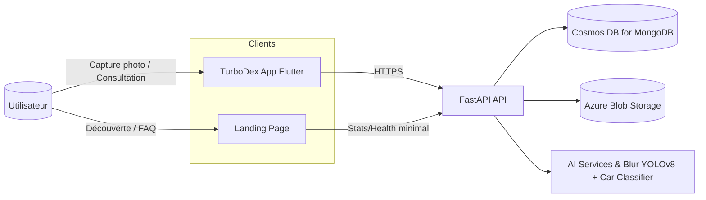

```mermaid
flowchart LR
  user[(Utilisateur)]

  subgraph Clients
    MAUI["TurboDex App Flutter"]
    LP["Landing Page"]
  end

  API[FastAPI API]
  AI["AI Services & Blur YOLOv8 + Car Classifier"]
  DB[(Cosmos DB for MongoDB)]
  BLOB[(Azure Blob Storage)]

  user -->|Capture photo / Consultation| MAUI
  user -->|Découverte / FAQ| LP
  MAUI -->|HTTPS| API
  LP -->|Stats/Health minimal| API
  API --> DB
  API --> BLOB
  API --> AI
```
