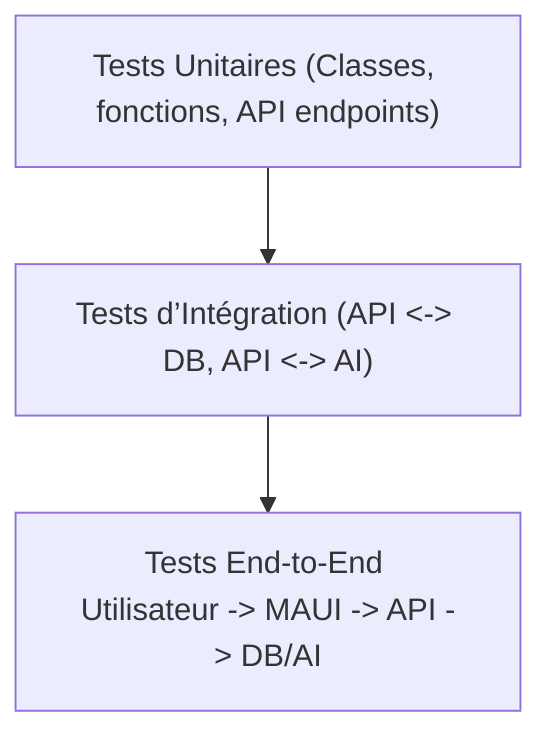

```mermaid
  flowchart TB
  Unit["Tests Unitaires (Classes, fonctions, API endpoints)"]
  Integration["Tests d’Intégration (API <-> DB, API <-> AI)"]
  E2E["Tests End-to-End Utilisateur -> MAUI -> API -> DB/AI"]

  Unit --> Integration --> E2E
```
